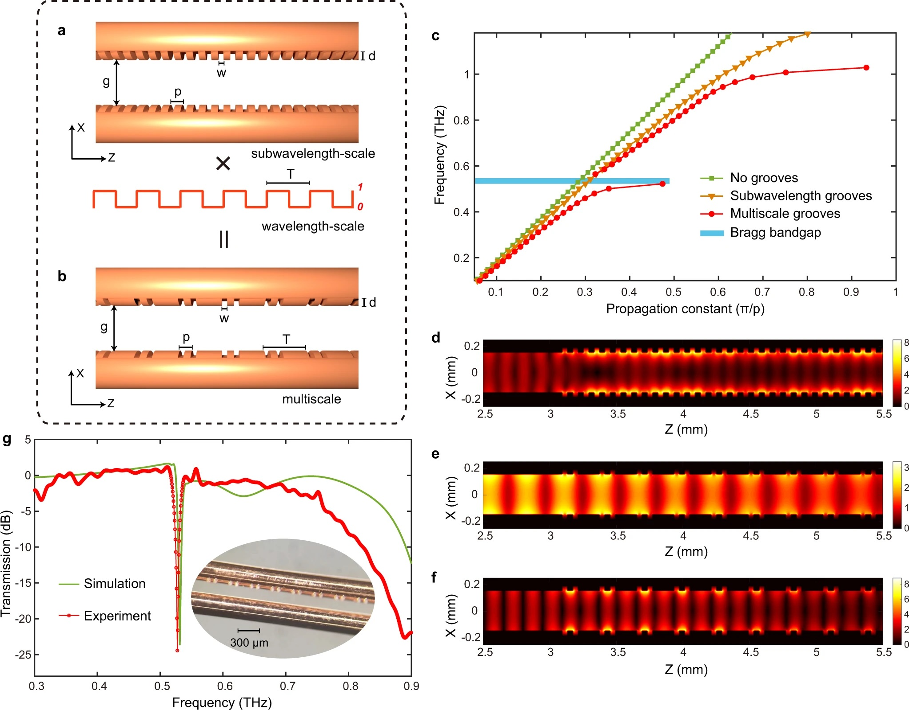
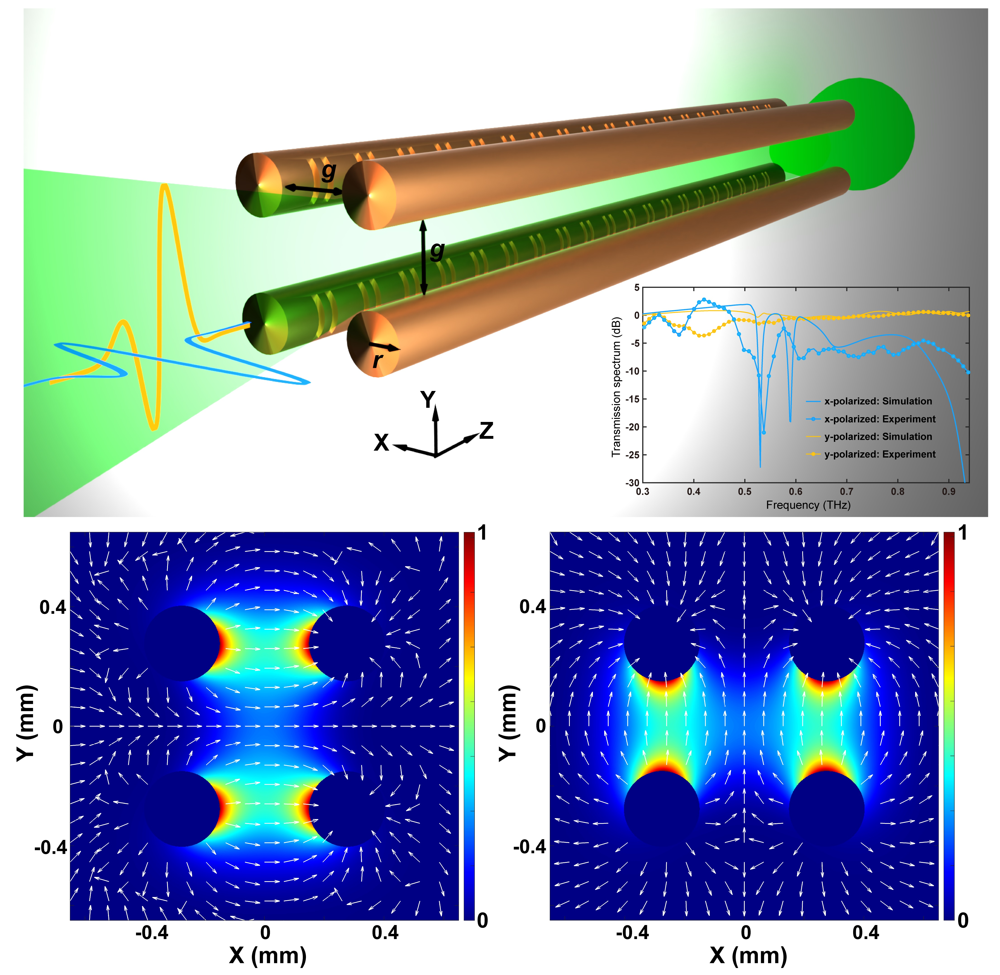

Communication links operating at THz frequencies are envisioned to provide a revolutionary enhancement of data transmission, not only by targeting unprecedented data-rates but also inherently supporting ultra-high bandwidth and ultra-low latency communication protocols. As a building block, waveguides play a pivotal role in the full deployment of THz communication systems. Besides the capability of signal transporting, innovative THz waveguides are demanded to provide versatile signal-processing functionalities.

To this end, we proposed a universal approach for the realization of broadband THz signal processing in metal-wire waveguides by engineering the wire surfaces. our results demonstrated that, by engraving judiciously designed grooves directly on metal-wires, THz waveguide-integrated Bragg gratings can be realized without the introduction of any additional materials. Such an approach, in combination with novel waveguide designs, leads to a unique platform with remarkable structural simplicity, yet featuring unprecedented signal-processing functionalities. Our latest invention is a new waveguide topology, namely, a [four-wire waveguide](https://www.nature.com/articles/s41467-022-27993-7), which is capable of sustaining two independent and orthogonally polarized fundamental modes, and thus, it can be operated as a broadband polarization-division multiplexer. Most importantly, by integrating Bragg gratings on wires into such a multiplexer, we realized, for the first time, the independent manipulation of polarization-division multiplexed THz signals. This device opens up new exciting perspectives for exploiting the polarization degree of freedom and ultimately boosting the capacity and spectral efficiency of future 6G networks.

Based on metal-wire waveguides, we also developed a [tapered two-wire waveguide](https://onlinelibrary.wiley.com/doi/abs/10.1002/lpor.202100051), which is able to realize the time-domain integration of broadband THz pulses. This structure consists of two metal wires separated by a variable air gap that shrinks down to a subwavelength size as the movement takes from the waveguide input to its output. We demonstrate that while an input THz pulse propagates toward the subwavelength output gap, it is reshaped into its first-order time integral waveform. Most recently, we successfully introduced groove structures with a [topological interface](https://www.degruyter.com/document/doi/10.1515/nanoph-2023-0900/html) into our waveguide, leading to the realization of a first-order differential equation solver. These devices are envisioned to serve as key components for the implementation of complex and ultrahigh-speed analog signal processing operations in THz communication systems.

