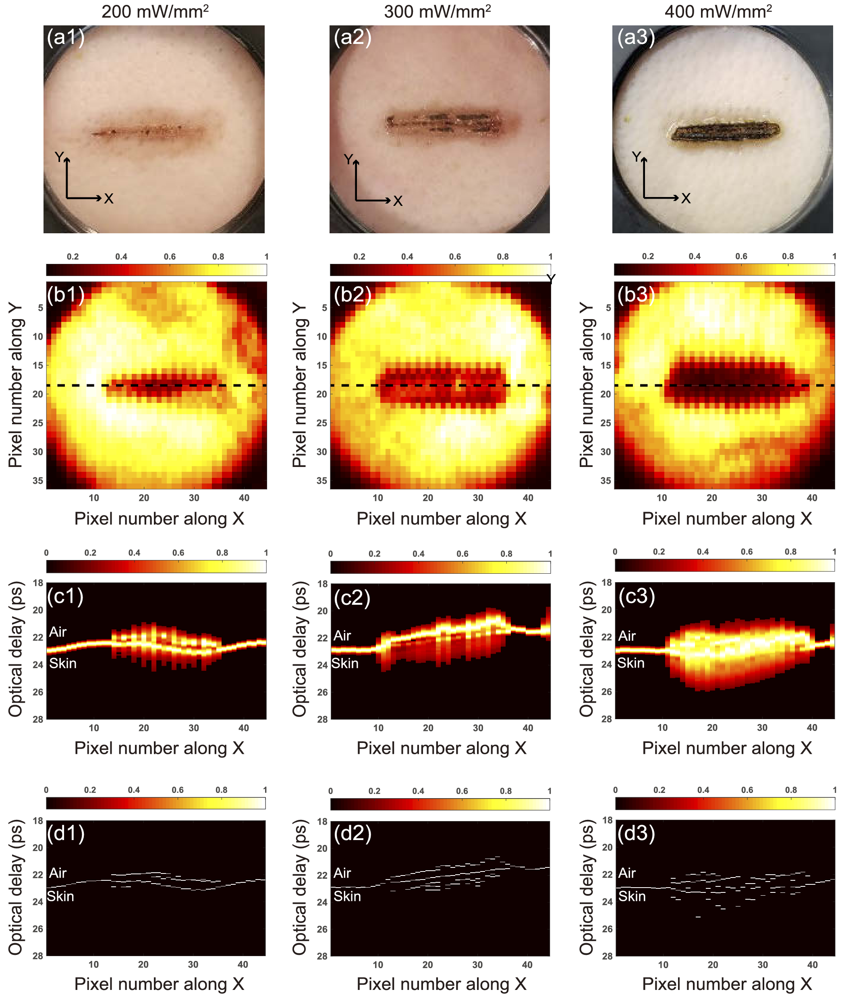

THz biophotonics focuses on applying THz photonic technology in biomedicine, drawing attention due to the unique features of THz waves, such as the extreme sensitivity to water, resonance with biomolecules, and nonionizing photon energy.

Our group has pioneered a key biomedical application by combining THz imaging with laser tissue soldering. In view of minimally-invasive clinical interventions, nanoparticle-assisted laser tissue soldering is emerging as an appealing concept in surgical medicine, holding the promise of surgery without sutures. However, such a therapy has not been employed in clinical settings yet, mainly due to the fact that rapid elevation in temperature can cause significant photothermal tissue damage. To overcome this issue, we developed a novel [THz thermometry system](https://pubs.aip.org/aip/app/article/4/12/126106/123230) for monitoring the laser-tissue interaction and visualizing the localized photothermal damage, by taking advantage of the characteristic sensitivity of THz radiation to the hydration level in biological tissue. Our results demonstrated that THz imaging is able to monitor the temperature variation and reveal the [thermally-affected evolution in three dimensions](https://opg.optica.org/boe/fulltext.cfm?uri=boe-11-4-2254&id=429543). We aim to enable this technique in clinical settings, targeting wound healing in delicate tissues, such as corneal, blood vessels, as well as nerves.

