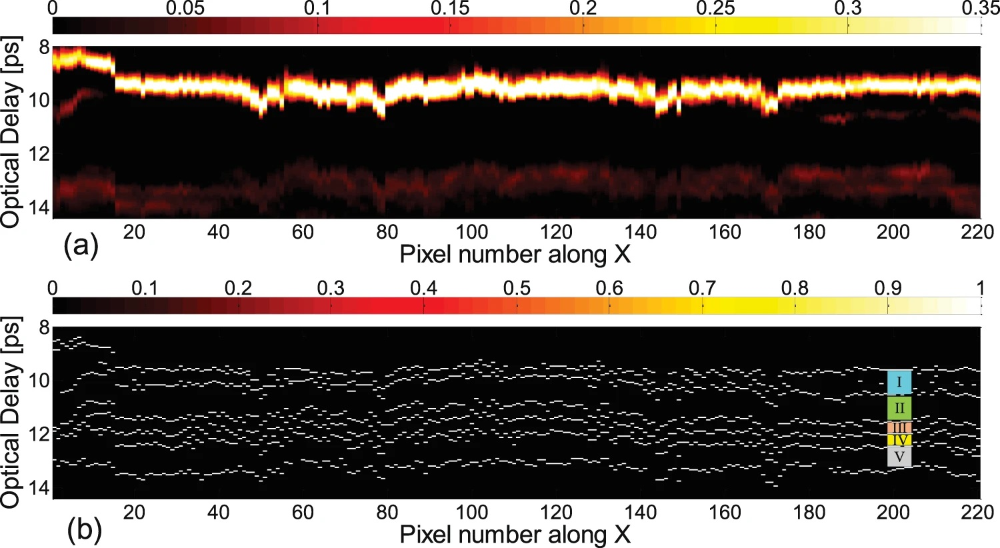

Due to the unique penetration ability of THz radiation in many electrically insulating materials, THz imaging has garnered significant interest as a non-invasive, non-contact, and non-ionizing modality to characterize various non-metallic materials. Our group focuses on exploring the potential and enhancing the capability of THz imaging for the nondestructive evaluation of multilayered structures.

The experimental technique we use is THz time-of-flight tomography, in which a quasi-single-cycle THz pulse impinges on a layered sample and the reflections of the pulse due to dielectric discontinuities at material interfaces are measured. The time-delays between successive echoes of the incident THz pulse can then be exploited to back out the various layer thicknesses, that is, to reconstruct the sample. In particular, we have developed a series of advanced [deconvolution](https://ieeexplore.ieee.org/abstract/document/7874211) techniques that can achieve super-resolution as successive echoes may overlap in time if the layers are thin. Such innovative techniques overcome the conventional limitation of the axial resolution, in turn allowing for resolving [optically thin layers](https://opg.optica.org/ol/abstract.cfm?uri=ol-42-9-1828) in the THz regime. Driven by such techniques, the full promise of THz imaging was unlocked and through extensive collaborations, killer applications have been identified, such as the nondestructive evaluation of [fiber-reinforced composites](https://www.sciencedirect.com/science/article/abs/pii/S1359836815003327) and [multilayered coating on steel](https://ieeexplore.ieee.org/abstract/document/7572023), which are widely used in aerospace, automotive, marine, and energy sectors. 

In particular, our group has pioneered a way forward for the THz investigation of artwork and archaeological artifacts, which is considered one of the most exciting THz applications. With the THz time-of-flight tomography coupled with advanced signal-processing approaches, we revealed the global and detailed stratigraphy of a [17th-century easel painting](https://www.nature.com/articles/s41598-017-15069-2) with layer thicknesses less than 50 microns, and most recently, we uncovered the obscured inscriptions on a [16th-century funerary cross](https://www.nature.com/articles/s41598-022-06982-2). These results have been featured on the cover of [Optics and Photonics News (OPN)](https://www.optica-opn.org/home/articles/volume_29/march_2018/features/cultural_artifacts_in_terahertz_light/) and reported in the media including [The New York Times](https://www.nytimes.com/2018/02/20/science/picasso-blue-period-scans.html?partner=rss&emc=rss) and [American Scientist](https://www.americanscientist.org/article/unearthing-a-prayer-for-the-dead). 
